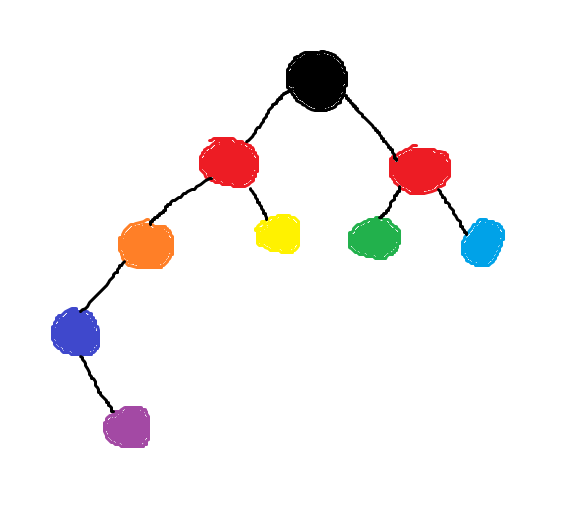

# Regenboogboom

Project uit mijn 2e bachelor Informatica, waar we een regenboogboom datastructuur moesten implementeren. 

Een regenboogboom is een variatie van een rood-zwartboom.

[verslag.pdf](https://github.com/noahvsb/regenboogboom/blob/b8b5871ec459f993d4fe39c5a3aeb13c83cb87ed/extra/verslag.pdf)
